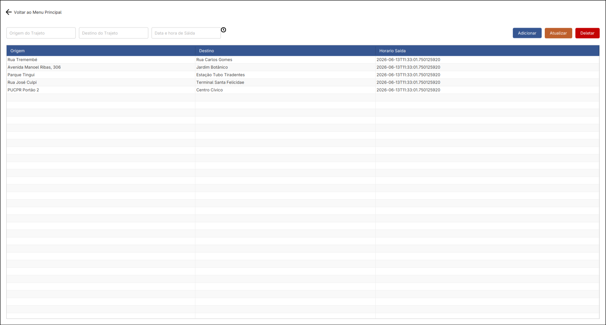
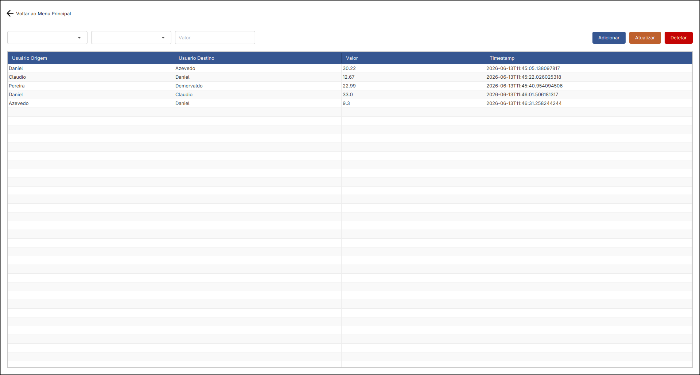
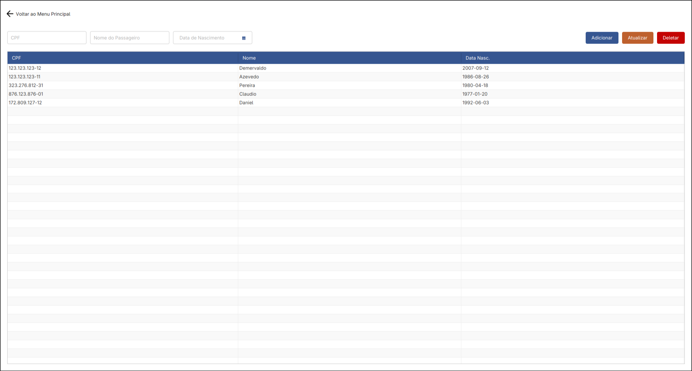
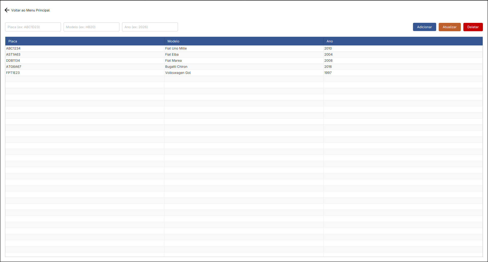
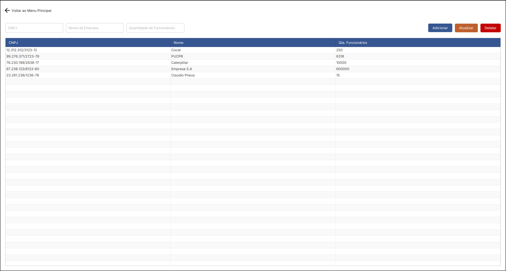

    <h1>Cocar</h1>
    <h3>Documento de Engenharia de Software</h3>
    
<strong>Integrantes`:</strong>
`
    <ul>
        <li>André Murilo Pinz Gomes</li>
        <li>Eduardo Skororobotei Gomes</li>
        <li>João Pedro Gadens Mosson</li>
        <li>João Pedro Magri Pozzan</li>
    </ul>

## Contextualização e Problema
A ideia do projeto surgiu das dificuldades diárias de deslocamento da equipe e da alta incidência de veículos com ocupante único (apenas motorista) no entorno da PUCPR.

**Limitações nos transportes observados:**
* **Transporte Público:** Sofre com superlotação, tempos de viagem elevados, rotas inflexíveis e problemas de disponibilidade e conexões.
* **Transporte Privado:** Gera congestionamentos, agrava a emissão de poluentes e exige alto custo com manutenção, combustível e estacionamento.
* **Transporte por Aplicativo:** Apresenta disponibilidade imprevisível e tarifas dinâmicas, encarecendo o serviço justamente nos picos de maior demanda.

**Dificuldades da carona tradicional:**
* **Logística:** Encontrar passageiros com origem e destino compatíveis com rota e horários do motorista.
* **Atrito Financeiro:** Desconforto de exigir pagamento ou calcular a divisão de custos diretamente com conhecidos ou colegas.
* **Segurança:** Ter certeza de quem são as pessoas que está compartilhado carona e que são confiáveis e respeitosas.
* **Confiança:** Deixar de usar outro meio de transporte e ter certeza que conseguirá fazer os trajetos que precisa com caronas.

## Contexto de Experiência Criativa

Para solucionar essas dores, idealizamos uma plataforma de mobilidade corporativa e acadêmica que elimina o atrito de organizar viagens compartilhadas. O projeto integra o escopo da disciplina de Experiência Criativa.

**Nossa Solução:**
* **Matchmaking Inteligente:** Algoritmo cruza automaticamente as rotas diárias dos motoristas com as necessidades de deslocamento dos passageiros, otimizando o desvio mínimo.
* **Rateio Automatizado:** O sistema calcula e gerencia a divisão de custos de forma transparente, eliminando a necessidade de cobrança interpessoal.
* **Gestão e Comunicação:** Centraliza e facilita a comunicação, simplificando a organização e a manutenção de longo prazo dos grupos de caronas.

**Modelo de Negócios e Parcerias:**
Expandimos o foco além das universidades para atender o setor corporativo (B2B). Nossa monetização baseia-se em assinaturas pagas pelas organizações parceiras, mantendo o uso subsidiado para o usuário final.

**Benefícios para Instituições Registradas:**
* **Infraestrutura:** Redução drástica na demanda e custos associados a vagas de estacionamento.
* **Sustentabilidade (ESG):** Diminuição mensurável da pegada de carbono da frota pendular da empresa.
* **Bem-estar:** Oferecimento de uma alternativa de transporte mais rápida e segura como benefício aos colaboradores/alunos.
* **Comunidade:** Promove a solidariedade, o networking e a interação social constante entre os membros da instituição.

## Escopo da Entrega

Para a disciplina de Programação Orientada a Objetos (POO), extraímos as entidades e fluxos críticos do projeto central e os implementamos em um aplicativo desktop utilizando JavaFX. O foco desta entrega é a gestão de dados (CRUDs) que sustenta a regra de negócios.

**Entidades Implementadas:**
* Trajetos
* Passageiros
* Empresas
* Benefícios
* Transações
* Veículos

# Arquitetura e Classes

## Classe: App
* **Implementação:** João Pedro Magri Pozzan
* **Descrição:** Classe principal (bootstrap) da aplicação JavaFX. Responsável por inicializar a janela, instanciar a view do menu principal (`MenuView`), configurar o roteador (`Router`) e mapear os eventos de clique dos botões para a navegação de seus respectivos controladores de CRUD.

### Métodos

#### `start(stage)`
* **Descrição:** Sobrescrita do ciclo de vida da classe `Application` do JavaFX. Realiza a montagem inicial: cria a `MenuView`, inicializa a classe utilitária `Router`, vincula os *listeners* (`setOnAction`) dos botões de navegação, carrega o arquivo de estilos (`app.css`) e exibe a janela em modo maximizado.
* **Parâmetros:** `stage` (`Stage`) — Palco principal do JavaFX onde a `Scene` inicial será renderizada.
* **Retorno:** `void`.

#### `main(args)`
* **Descrição:** Método ponto de entrada (*entry point*) do sistema Java. Aciona o método `launch()` interno para iniciar a thread e o ciclo de vida do JavaFX.
* **Parâmetros:** `args` (`String[]`) — Argumentos padrão de linha de comando.
* **Retorno:** `void`.

## Classe: MenuView
* **Implementação:** João Pedro Gadens Mosson
* **Descrição:** Classe responsável por construir a interface do menu principal da aplicação. Herdando de `StackPane`, ela atua como um contêiner base que agrupa e organiza os botões de navegação para os diferentes módulos de gerenciamento do sistema, além de carregar recursos visuais como a logo.

### Interface Gráfica

### Elementos da Interface e Uso
A tela apresenta o logo da aplicação e logo abaixo, uma lista de botões que o usuário pode clicar para navegar entre os módulos do sistema. Além disso, há um botão de saída, que permite ao usuário sair do aplicativo.

### Métodos

#### `MenuView()`
* **Descrição:** Construtor da classe. É responsável por instanciar todos os componentes visuais, aplicar as respectivas classes do CSS e estruturar o layout da tela.

#### `getTitulo()`
* **Descrição:** Retorna o texto que define o título da tela do menu principal.
* **Retorno:** String

#### `getBtnPassageiros()`
* **Descrição:** Retorna a referência do botão associado ao gerenciamento de passageiros.
* **Retorno:** Button

#### `getBtnVeiculos()`
* **Descrição:** Retorna a referência do botão associado ao gerenciamento de veículos.
* **Retorno:** Button

#### `getBtnTrajetos()`

* **Descrição:** Retorna a referência do botão associado ao gerenciamento de trajetos.
* **Retorno:** Button

#### `getBtnEmpresas()`

* **Descrição:** Retorna a referência do botão associado ao gerenciamento de empresas.
* **Retorno:** Button

#### `getBtnTransacoes()`

* **Descrição:** Retorna a referência do botão associado ao gerenciamento de transações.
* **Retorno:** Button

#### `getBtnSair()`
* **Descrição:** Retorna a referência do botão de saída.
* **Retorno:** Button

## Classe: Router
* **Implementação:** André Murilo Pinz Gomes
* **Descrição:** Classe responsável por gerenciar a navegação (roteamento) entre as diferentes telas da aplicação. Ela atua centralizando a lógica de troca de views, substituindo o root da scene, alterando o título da janela e injetando automaticamente a funcionalidade de retorno para o menu principal.

### Métodos

#### `Router(stage, menuPrincipal)`
* **Descrição:** Construtor da classe. Inicializa o roteador armazenando a referência da janela e da view do menu.
* **Parâmetros:** stage (`Stage`) — A janela (Stage) principal do JavaFX onde as cenas da aplicação são exibidas.
* **Parâmetros:** menuPrincipal (`MenuView`) — A instância da tela de menu principal, que servirá como ponto de retorno padronizado ao sair de outras telas.

#### `navegarPara(controller)`
* **Descrição:** Realiza a transição da interface atual para a tela associada ao controlador fornecido. O método extrai a view do controlador, configura o evento de clique do botão "voltar" dessa view para restaurar o menu principal e, em seguida, atualiza o título da janela e o nó raiz da cena para exibir a nova tela.
* **Parâmetros:** controller (`CRUDController<?, ?>`) — O controlador da tela de destino, que deve fornecer acesso à sua respectiva `CRUDView`.
* **Retorno:** `void`

## Classe: Repository
* **Implementação:** Eduardo Skoroboatei Gomes
* **Descrição:** Classe abstrata de persistência de dados responsável por realizar as operações CRUD (Criar, Ler, Atualizar, Excluir) para modelos de domínio da aplicação. Utiliza a serialização de objetos para ler e gravar listas de instâncias de classes que herdam de `Model` em arquivos binários (`.dat`). A classe lida automaticamente com a atribuição de IDs incrementais e verifica a unicidade dos registros para garantir a integridade dos dados e evitar duplicações.

### Métodos

#### `Repository(clazz)`
* **Descrição:** Construtor da classe. Define dinamicamente o nome do arquivo de persistência, concatenando o nome simplificado da classe do modelo (convertido para letras minúsculas) com a extensão `.dat`.
* **Parâmetros:** `clazz` (`Class<T>`) — A referência da classe do tipo genérico da entidade que será gerenciada pelo repositório.

#### `gravarArquivo(objetos)`
* **Descrição:** Método privado que serializa a lista de objetos carregada na memória e a escreve no arquivo de dados, utilizando a classe `ObjectOutputStream`. Trata e exibe erros de entrada e saída.
* **Parâmetros:** `objetos` (`ArrayList<T>`) — A lista de registros que será persistida.
* **Retorno:** `void`

#### `checarUnicidade(objetos, objeto)`
* **Descrição:** Método privado que verifica se já existe na base de dados algum registro em conflito com o objeto atual, utilizando o método `colideCom` definido pelo model. Ignora a comparação do objeto com ele mesmo (mesmo ID). Lança uma `IllegalArgumentException` caso detecte uma duplicidade.
* **Parâmetros:** `objetos` (`ArrayList<T>`) — A lista de registros atualmente carregados na memória.
* **Parâmetros:** `objeto` (`T`) — O objeto que está sendo validado.
* **Retorno:** `void`

#### `objetos()`
* **Descrição:** Abre o arquivo binário, realiza a desserialização dos dados utilizando `ObjectInputStream` e retorna a lista de objetos salvos. Retorna uma lista vazia caso o arquivo ainda não exista ou ocorra um erro durante a leitura.
* **Retorno:** `ArrayList<T>`

#### `comID(id)`
* **Descrição:** Percorre todos os objetos carregados em busca de um registro com id de valor fornecido. Retorna `null` se não encontrar.
* **Parâmetros:** `id` (`int`) — O identificador numérico único do objeto a ser pesquisado.
* **Retorno:** `T`

#### `adicionar(objeto)`
* **Descrição:** Cadastra um novo registro na base de dados. Executa a validação de unicidade, calcula o próximo ID disponível, vincula o novo ID ao objeto fornecido, insere na lista e grava o estado no disco.
* **Parâmetros:** `objeto` (`T`) — A nova entidade a ser inserida.
* **Retorno:** `void`

#### `remover(objetoRemover)`
* **Descrição:** Remove um registro da base de dados filtrando a lista atual e descartando a entidade cujo ID coincida com o do objeto passado como parâmetro. Grava a lista resultante no arquivo em seguida.
* **Parâmetros:** `objetoRemover` (`T`) — A referência do objeto que deverá ser excluído.
* **Retorno:** `void`

#### `atualizar(id, objetoAtualizado)`
* **Descrição:** Substitui os dados de um registro existente por uma versão mais recente. O método garante que o objeto atualizado retenha o ID original, checa restrições de unicidade, localiza o item pelo índice na lista, realiza a substituição e salva os dados. Retorna indicativo de sucesso ou falha na operação.
* **Parâmetros:** `id` (`int`) — O id do registro a ser atualizado.
* **Parâmetros:** `objetoAtualizado` (`T`) — A entidade contendo as modificações prontas para substituição.
* **Retorno:** `boolean`

## Classe: Model
* **Implementação:** João Pedro Magri Pozzan
* **Descrição:** Classe base abstrata para as entidades de domínio do sistema. Implementa a interface `Serializable` para habilitar a persistência dos dados em arquivos binários (gerenciada pela classe `Repository`). Estrutura propriedades e comportamentos comuns, como a manutenção do id e a lógica base de verificação de registros duplicados, delegando parte das regras de colisão às subclasses.

### Métodos

#### `getID()`
* **Descrição:** Recupera o id atribuído à entidade.
* **Retorno:** `int`

#### `setID(id)`
* **Descrição:** Define o id da entidade. É utilizado primariamente pela camada de persistência durante as operações de criação (auto-increment) e atualização de registros.
* **Parâmetros:** `id` (`int`) — O valor a ser atribuído como id do objeto.
* **Retorno:** `void`

#### `colideCom(objeto)`
* **Descrição:** Verifica se a instância atual entra em conflito de dados com o objeto fornecido. Executa validações de igualdade de referência, nulidade e tipo de classe para evitar erros de tipagem. Se as verificações iniciais passarem, converte o objeto para o tipo genérico `T` e delega a lógica de negócio específica para o método `checarColisao`.
* **Parâmetros:** `objeto` (`Object`) — A instância genérica a ser comparada com a entidade atual.
* **Retorno:** `boolean`

#### `checarColisao(objeto)`
* **Descrição:** Método projetado para ser sobrescrito pelas subclasses caso a entidade possua regras de negócio específicas para evitar duplicidade (como validar se um CPF ou Placa já existem, por exemplo). Sua implementação padrão sempre retorna `false`, permitindo inserções livres caso não seja substituído.
* **Parâmetros:** `objeto` (`T`) — A entidade de mesmo tipo para comparação dos atributos de negócio.
* **Retorno:** `boolean`

## Classe: CRUDController
* **Implementação:** Eduardo Skororobotei Gomes
* **Descrição:** Classe abstrata que atua como o controlador base para as operações de CRUD (Create, Read, Update, Delete). Ela faz a ponte entre a interface gráfica genérica (`CRUDView`) e a camada de persistência (`Repository`), gerenciando a inicialização da lista de dados, validações base de formulário, injeção de eventos nos botões de ação e a exibição de alertas (mensagens de erro ou advertência). Delega tradução entre os campos do formulário e model para suas subclasses por meio de métodos abstratos.

### Métodos

#### `CRUDController(view, clazz)`
* **Descrição:** Construtor da classe. Inicializa a class view, instancia o repositório para a respectivo model, vincula a tabela da interface aos dados persistidos (via `ObservableList`) e faz a configuração das ações dos botões.
* **Parâmetros:** `view` (`V`) — A instância da interface gráfica de CRUD associada ao controlador.
* **Parâmetros:** `clazz` (`Class<T>`) — A referência da classe de domínio.

#### `setupActions()`
* **Descrição:** Método privado que associa os métodos CRUD (adicionar, deletar, atualizar) aos eventos de clique dos botões na interface. Adicionalmente, configura um listener na tabela para detectar duplo clique em uma linha, carregando os dados do item selecionado de volta para os campos do formulário.
* **Retorno:** `void`

#### `mostrarErroValidacao(mensagem)`
* **Descrição:** Método utilitário responsável por instanciar e exibir um alerta modal de erro (do tipo `Alert.AlertType.ERROR` do JavaFX) sempre que uma exceção de validação for capturada durante as operações de CRUD.
* **Parâmetros:** `mensagem` (`String`) — O texto contendo o detalhamento do erro.
* **Retorno:** `void`

#### `validarCamposPreenchidos()`
* **Descrição:** Método utilitário que percorre os componentes contidos no formulário da interface. Verifica se os campos estão preenchidos e lança uma `IllegalArgumentException` caso detecte que algum deles encontra-se vazio ou não selecionado.
* **Retorno:** `void`

#### `limparCampos()`
* **Descrição:** Método utilitário que itera sobre os componentes do formulário e redefine seus valores para o estado vazio/nulo, limpando a tela após inserções ou atualizações bem-sucedidas.
* **Retorno:** `void`

#### `camposParaModel()`
* **Descrição:** Método abstrato. Exige que as subclasses concretas implementem a lógica para extrair os valores inseridos pelo usuário nos campos específicos do formulário e os utilizem para construir e retornar uma nova instância do modelo de negócio.
* **Retorno:** `T`

#### `modelParaCampos(selecionado)`
* **Descrição:** Método abstrato. Exige que as subclasses concretas implementem a lógica inversa: extrair as informações de um objeto do modelo e preencher os respectivos campos na tela para que o usuário possa visualizar ou editar os dados.
* **Parâmetros:** `selecionado` (`T`) — A entidade de domínio contendo os dados a serem exibidos no formulário.
* **Retorno:** `void`

#### `getView()`
* **Descrição:** Retorna a instância da interface gráfica manipulada pelo controlador.
* **Retorno:** `CRUDView<T>`

#### `adicionar()`
* **Descrição:** Executa a rotina de criação (Create). Valida se todos os campos estão preenchidos, aciona a conversão dos dados visuais para o modelo, envia a entidade ao repositório para persistência, atualiza a exibição da tabela com os novos dados e, por fim, limpa o formulário. Erros disparam alertas em tela.
* **Retorno:** `void`

#### `ler()`
* **Descrição:** Executa a rotina de leitura (Read). Consulta o repositório em busca de todos os registros salvos, atualizando a `ObservableList` que reflete os dados automaticamente na tabela da interface de usuário.
* **Retorno:** `void`

#### `atualizar()`
* **Descrição:** Executa a rotina de modificação (Update). Primeiramente, certifica-se de que um item está selecionado na tabela, exibindo um alerta em caso negativo. Estando selecionado, efetua as validações de campos vazios, converte os novos valores visuais em uma entidade e chama o método atualizar do repositório com o ID do item original. Em seguida, sincroniza a tabela e esvazia o formulário.
* **Retorno:** `void`

#### `deletar()`
* **Descrição:** Executa a rotina de exclusão (Delete). Confere a seleção de um item na tabela, alertando o usuário se não existir, chama o método de remoção do repositório e recarrega os dados da tabela.
* **Retorno:** `void`

## Classe: CRUDView
* **Implementação:** João Pedro Gadens Mosson
* **Descrição:** Classe abstrata que define a estrutura de interface padrão para as telas de gerenciamento (CRUD) do sistema, herdando de `BorderPane` do JavaFX. Ela encapsula a construção do layout base, fornecendo componentes visuais comuns como botões de ação ("Adicionar", "Atualizar", "Deletar"), um botão de retorno ao menu, um contêiner de formulário e uma tabela de exibição de dados, delegando as especificidades (como título e mapeamento de colunas da tabela) para as subclasses.

### Interface Gráfica

### Elementos da Interface e Uso
Na parte superior, encontra-se o botão "Voltar ao Menu Principal", que permite ao usuário retornar à tela inicial. A região central é composta por uma barra de ferramentas, e, logo abaixo, uma tabela com a listagem de objetos. A barra de ferramentas abriga no lado esquerdo um espaço reservado para os campos de formulário e, alinhados à direita, os botões de ação do CRUD, utilizados para manipular os dados na tabela e no repositório.

### Métodos

#### `CRUDView()`
* **Descrição:** Construtor da classe. Responsável por instanciar os elementos da interface, aplicar os identificadores de estilo CSS pertinentes e organizar o layout da tela. Ao final da preparação base, chama o o método abstrato `configurarColunas()`.

#### `configurarColunas()`
* **Descrição:** Método abstrato. Exige que as classes derivadas implementem a criação das colunas específicas da `TableView` e façam o vínculo com os atributos do model que será exibido.
* **Retorno:** `void`

#### `getTitulo()`
* **Descrição:** Método abstrato. Exige que as subclasses definam e retornem o texto do título da janela (`Stage`).
* **Retorno:** `String`

#### `getBtnVoltar()`
* **Descrição:** Retorna a referência do botão de retorno ao menu principal.
* **Retorno:** `Button`

#### `getBtnAdicionar()`
* **Descrição:** Retorna a referência do botão de cadastro, permitindo ao controlador registrar o evento da operação de criação (Create).
* **Retorno:** `Button`

#### `getBtnAtualizar()`
* **Descrição:** Retorna a referência do botão de edição, permitindo ao controlador registrar o evento da operação de atualização (Update).
* **Retorno:** `Button`

#### `getBtnDeletar()`
* **Descrição:** Retorna a referência do botão de exclusão, permitindo ao controlador registrar o evento da operação de deleção (Delete).
* **Retorno:** `Button`

#### `getTabela()`
* **Descrição:** Retorna a referência da tabela (`TableView`) onde os registros são listados e selecionados pelo usuário.
* **Retorno:** `TableView<T>`

#### `getFormulario()`
* **Descrição:** Retorna a referência do contêiner (`HBox`) que atua como formulário.
* **Retorno:** `HBox`

## Classe: CNPJ
* **Implementação:** João Pedro Magri Pozzan
* **Descrição:** Classe de validação que encapsula e representa um CNPJ. Implementa a interface `Serializable` para permitir sua persistência em arquivos. Sua principal responsabilidade é tratar o dado bruto de entrada, limpando caracteres não numéricos, validando se a quantidade de dígitos confere com o padrão de 14 caracteres numéricos e, em caso positivo, armazenando o valor com a máscara oficial (XX.XXX.XXX/XXXX-XX).

### Métodos

#### `CNPJ(valor)`
* **Descrição:** Construtor da classe. Recebe o dado de entrada, utiliza regex para remover qualquer caractere que não seja numérico e verifica se a string resultante possui exatamente 14 caracteres. Caso não possua, lança uma `IllegalArgumentException`. Caso seja válido, aplica a máscara padrão de formatação e armazena no atributo `valor`.
* **Parâmetros:** valor (`String`) — A cadeia de caracteres representando o CNPJ (podendo conter formatação prévia ou ser apenas números).

#### `getValor()`
* **Descrição:** Recupera a string do CNPJ armazenada internamente, que já contém a máscara formatada.
* **Retorno:** `String`

#### `toString()`
* **Descrição:** Sobrescreve o método `toString` padrão da linguagem para retornar diretamente o valor formatado do CNPJ, facilitando sua exibição.
* **Retorno:** `String`

#### `equals(o)`
* **Descrição:** Sobrescreve o método de igualdade padrão para comparar duas instâncias de `CNPJ` com base no conteúdo (valor textual do CNPJ). Garante segurança de tipo ao checar nulidade e a classe do objeto comparado.
* **Parâmetros:** o (`Object`) — A referência do objeto genérico a ser comparado com a instância atual.
* **Retorno:** `boolean`

## Classe: CPF
* **Implementação:** João Pedro Magri Pozzan
* **Descrição:** Classe de validação que encapsula e representa um CPF. Implementa a interface `Serializable` para permitir sua persistência em arquivo. Sua principal responsabilidade é tratar o dado bruto de entrada, limpando caracteres não numéricos, validando se a quantidade de dígitos confere com o padrão de 11 caracteres numéricos e, em caso positivo, formatando e armazenando o valor com a máscara oficial (XXX.XXX.XXX-XX).

### Métodos

#### `CPF(valor)`
* **Descrição:** Construtor da classe. Recebe o dado de entrada, utiliza regex para remover qualquer caractere que não seja numérico e verifica se a string limpa possui exatamente 11 caracteres. Caso não possua, lança uma `IllegalArgumentException`. Sendo válido, aplica a máscara padrão de formatação e armazena o resultado no atributo `valor`.
* **Parâmetros:** `valor` (`String`) — A string que representa o CPF, pode conter formatação prévia ou ser composta apenas por números.

#### `getValor()`
* **Descrição:** Recupera a string do CPF armazenada internamente, que já contém a máscara devidamente formatada.
* **Retorno:** `String`

#### `toString()`
* **Descrição:** Sobrescreve o método `toString` padrão da classe `Object` para retornar diretamente o valor formatado do CPF.
* **Retorno:** `String`

#### `equals(o)`
* **Descrição:** Sobrescreve o método de igualdade padrão para comparar duas instâncias de `CPF` com base em seu conteúdo (o valor textual do CPF). Inclui verificações de segurança para garantir a tipagem correta e checar nulidade antes de realizar a comparação das strings.
* **Parâmetros:** `o` (`Object`) — A referência do objeto genérico a ser comparado com a instância atual.
* **Retorno:** `boolean`

## Classe: Placa
* **Implementação:** André Murilo Pinz Gomes
* **Descrição:** Classe utilitária de validação que encapsula e representa o tipo de dado de Placa de veículo. Implementa a interface `Serializable` para viabilizar sua persistência em arquivos. Sua responsabilidade é processar a string de entrada, padronizando os caracteres para letras maiúsculas, removendo símbolos indesejados e validando o formato por meio de expressões regulares. É compativel tanto com o padrão de placas brasileiro antigo (ex: ABC1234) quanto com o padrão Mercosul (ex: ABC1D23).

### Métodos

#### `Placa(valor)`
* **Descrição:** Construtor da classe. Recebe o dado bruto, converte todos os caracteres para maiúsculo e aplica uma expressão regular para descartar o que não for letra ou número. Em seguida, testa a string limpa contra os padrões esperados. Lança uma `IllegalArgumentException` caso o formato seja inválido; caso contrário, atribui o valor higienizado ao atributo `valor`.
* **Parâmetros:** `valor` (`String`) — A cadeia de caracteres da placa do veículo inserida pelo usuário ou carregada do sistema.

#### `getValor()`
* **Descrição:** Recupera a string da placa armazenada internamente após o processo de validação e formatação.
* **Retorno:** `String`

#### `toString()`
* **Descrição:** Sobrescreve o método `toString` nativo para retornar diretamente o valor formatado da placa. Permite a exibição simplificada do objeto em interfaces de usuário ou terminais sem necessidade de invocar métodos de acesso adicionais.
* **Retorno:** `String`

#### `equals(o)`
* **Descrição:** Sobrescreve o método de igualdade padrão da linguagem. Compara duas instâncias de `Placa` com base estritamente em seus conteúdos textuais. O método confere nulidade e correspondência exata de classe antes da conversão (cast).
* **Parâmetros:** `o` (`Object`) — A referência do objeto genérico a ser verificado contra a instância atual de Placa.
* **Retorno:** `boolean`

## Classe: TrajetoController
* **Implementação:** Eduardo Skororobotei Gomes
* **Descrição:** Classe controller responsável por gerenciar o fluxo de dados para a entidade `TrajetoModel`. Herdando de `CRUDController`, ela faz a ponte entre a interface gráfica `TrajetoView` e o repositório, implementando as regras de extração e injeção de dados dos campos do formulário para o modelo.

### Métodos

#### `TrajetoController()`
* **Descrição:** Construtor da classe. Inicializa o controlador chamando o construtor da superclasse com uma nova instância de `TrajetoView` e referenciando a classe `TrajetoModel`.

#### `camposParaModel()`
* **Descrição:** Captura os dados inseridos pelo usuário nos campos de texto e no seletor de data/hora da interface gráfica, instanciando e retornando um novo objeto `TrajetoModel`.
* **Retorno:** `TrajetoModel`

#### `modelParaCampos(selecionado)`
* **Descrição:** Recebe um modelo de trajeto selecionado e preenche os campos do formulário na interface gráfica com os dados correspondentes para visualização ou edição.
* **Parâmetros:** `selecionado` (`TrajetoModel`) — O objeto modelo cujos dados serão exibidos nos campos visuais.
* **Retorno:** `void`

## Classe: TrajetoModel
* **Implementação:** Eduardo Skororobotei Gomes
* **Descrição:** Classe de domínio que representa um trajeto na aplicação. Encapsula as informações fundamentais de uma rota, como o local de origem, o local de destino e o horário de saída previsto.

### Métodos

#### `TrajetoModel(origem, destino, horarioSaida)`
* **Descrição:** Construtor da classe. Inicializa uma nova instância de um trajeto com as informações de rota e horário fornecidas.
* **Parâmetros:** `origem` (`String`) — O local de partida do trajeto.
* **Parâmetros:** `destino` (`String`) — O local de chegada do trajeto.
* **Parâmetros:** `horarioSaida` (`LocalDateTime`) — A data e a hora programadas para o início do trajeto.

#### `getOrigem()`
* **Descrição:** Retorna o local de origem do trajeto.
* **Retorno:** `String`

#### `getDestino()`
* **Descrição:** Retorna o local de destino do trajeto.
* **Retorno:** `String`

#### `getHorarioSaida()`
* **Descrição:** Retorna a data e o horário programados para a saída do trajeto.
* **Retorno:** `LocalDateTime`

## Classe: TrajetoView

* **Implementação:** Eduardo Skoroboatei Gomes
* **Descrição:** Classe responsável pela interface gráfica do módulo de gerenciamento de trajetos. Herda as estruturas padrão de `CRUDView` e adiciona componentes específicos, como campos de texto para origem e destino, além de um seletor especializado de data e hora.

### Interface Gráfica

### Elementos da Interface e Uso
* A interface exibe um formulário de entrada contendo dois campos de texto (`TextField`) para o preenchimento da "Origem do Trajeto" e "Destino do Trajeto", e um componente de calendário e relógio (`LocalDateTimeTextField`) para a "Data e hora de Saída". Abaixo do formulário, a tabela exibe os trajetos cadastrados.

### Métodos

#### `TrajetoView()`
* **Descrição:** Construtor da classe. Instancia os campos de formulário (origem, destino, horário de saída), define seus textos de instrução e os adiciona ao formulário.

#### `configurarColunas()`
* **Descrição:** Método sobrescrito que cria e configura as colunas da tabela (Origem, Destino, Horario Saída), vinculando cada coluna às propriedades correspondentes das instâncias de `TrajetoModel`.
* **Retorno:** `void`

#### `getTitulo()`
* **Descrição:** Retorna o título da tela, que será exibido na barra da janela principal.
* **Retorno:** `String`

#### `getOrigem()`
* **Descrição:** Retorna o campo de texto destinado ao preenchimento do local de origem.
* **Retorno:** `TextField`

#### `getDestino()`
* **Descrição:** Retorna o campo de texto destinado ao preenchimento do local de destino.
* **Retorno:** `TextField`

#### `getHorarioSaida()`
* **Descrição:** Retorna o campo de seleção utilizado para capturar a data e a hora de saída.
* **Retorno:** `LocalDateTimeTextField`

## Classe: TransacaoController
* **Implementação:** Eduardo Skororobotei Gomes
* **Descrição:** Controlador responsável por orquestrar o gerenciamento de transações. Além de implementar o fluxo básico do CRUD, a classe cuida do carregamento das listas de passageiros (usuários) nos seletores da interface e garante o tratamento de exceções na conversão do campo numérico de valor.

### Métodos

#### `TransacaoController()`
* **Descrição:** Construtor da classe. Inicializa o controlador atrelando o `TransacaoView` ao `TransacaoModel`. Também acessa o repositório de `PassageiroModel` para popular os menus suspensos (*ComboBoxes*) de usuários de origem e destino na interface.

#### `camposParaModel()`
* **Descrição:** Extrai os IDs dos passageiros selecionados nos menus e o valor monetário inserido no campo de texto. Realiza a conversão do texto para um número decimal e retorna um novo objeto `TransacaoModel`.
* **Retorno:** `TransacaoModel`

#### `modelParaCampos(selecionado)`
* **Descrição:** Preenche a interface gráfica a partir do modelo, selecionando as instâncias correspondentes de passageiro nos menus de origem e destino, e convertendo o valor numérico da transação de volta para texto.
* **Parâmetros:** `selecionado` (`TransacaoModel`) — O objeto contendo os dados da transação a ser carregada.
* **Retorno:** `void`

## Classe: TransacaoModel
* **Implementação:** Eduardo Skororobotei Gomes
* **Descrição:** Modelo de dados que representa uma transação realizada entre dois usuários do sistema. O modelo armazena os identificadores do usuário que envia (origem) e do que recebe (destino), a quantia transferida e registra o momento exato em que a transação foi instanciada.

### Métodos

#### `TransacaoModel(userOrigemID, userDestinoID, valor)`
* **Descrição:** Construtor da classe. Atribui os identificadores de origem e destino, além do valor da transação. Define automaticamente a propriedade `timestamp` com a data e hora do momento da criação da instância.
* **Parâmetros:** `userOrigemID` (`int`) — O id do usuário que origina a transação.
* **Parâmetros:** `userDestinoID` (`int`) — O id do usuário que recebe a transação.
* **Parâmetros:** `valor` (`double`) — O valor monetário atrelado à transação.

#### `getUserOrigemID()`
* **Descrição:** Recupera o ID do usuário de origem.
* **Retorno:** `int`

#### `getUserDestinoID()`
* **Descrição:** Recupera o ID do usuário de destino.
* **Retorno:** `int`

#### `getValor()`
* **Descrição:** Recupera o valor da transação.
* **Retorno:** `double`

#### `getTimestamp()`
* **Descrição:** Recupera a marcação temporal (data e hora exata) de quando a transação foi criada.
* **Retorno:** `LocalDateTime`

#### `getUserOrigem()`
* **Descrição:** Busca dinamicamente e retorna o objeto passageiro associado ao ID de origem, utilizando uma instância do repositório de `PassageiroModel`.
* **Retorno:** `PassageiroModel`

#### `getUserDestino()`
* **Descrição:** Busca dinamicamente e retorna o objeto passageiro associado ao ID de destino, utilizando uma instância do repositório de `PassageiroModel`.
* **Retorno:** `PassageiroModel`

## Classe: TransacaoView
* **Implementação:** Eduardo Skororobotei Gomes
* **Descrição:** Componente de interface gráfica voltado para a exibição e captação de dados sobre transações. Herda a estrutura de tela do `CRUDView` e introduz menus para a definição das partes envolvidas na transação, além de um campo para entrada do valor financeiro.

### Interface Gráfica

### Elementos da Interface e Uso

* O formulário visual desta tela é composto por dois `ComboBox` que permitem selecionar a partir da lista de passageiros o "Usuário Origem" e o "Usuário Destino". Ao lado, um `TextField` capta o montante financeiro da operação ("Valor"). A tabela de dados exibe esses registros, adicionalmente com o `Timestamp` da transação.

### Métodos

#### `TransacaoView()`
* **Descrição:** Construtor da tela. Instancia os seletores de usuários (origem e destino) e o campo de valor, define seus textos de instrução (*prompt text*) e insere todos eles no contêiner de formulário.

#### `configurarColunas()`
* **Descrição:** Implementação de método obrigatório do `CRUDView`. Fabrica e atrela as colunas da tabela de transações para exibir as representações textuais dos passageiros de origem e destino, o valor transferido (tratado como objeto *Double*) e o timestamp em que a operação ocorreu.
* **Retorno:** `void`

#### `getTitulo()`
* **Descrição:** Fornece o título da janela a ser gerada para este módulo de interface.
* **Retorno:** `String`

#### `getUserOrigem()`
* **Descrição:** Retorna a referência do menu de seleção atrelado ao usuário que inicia a transação.
* **Retorno:** `ComboBox<PassageiroModel>`

#### `getUserDestino()`
* **Descrição:** Retorna a referência do menu de seleção atrelado ao usuário que recebe a transação.
* **Retorno:** `ComboBox<PassageiroModel>`

#### `getValor()`
* **Descrição:** Retorna a referência do campo de texto usado para preencher ou visualizar o valor da transação.
* **Retorno:** `TextField`

## Classe: PassageiroController

* **Implementação:** João Pedro Gadens Mosson
* **Descrição:** Classe controladora responsável por intermediar a interface gráfica `PassageiroView` e a camada de dados `PassageiroModel`. Herda as funcionalidades padronizadas de `CRUDController` para gerenciar as operações de conversão e transferência de dados inseridos no formulário para a entidade de negócio e vice-versa.

### Métodos

#### `PassageiroController()`
* **Descrição:** Construtor da classe. Invoca o construtor da superclasse passando uma nova instância da view de passageiros (`PassageiroView`) e a referência de classe do modelo correspondente (`PassageiroModel.class`).

#### `camposParaModel()`
* **Descrição:** Extrai os valores inseridos pelo usuário nos campos de texto (CPF e Nome) e no seletor de data (Data de Nascimento). A partir desses dados, instancia e retorna um novo objeto do tipo `PassageiroModel`.
* **Retorno:** `PassageiroModel`

#### `modelParaCampos(selecionado)`
* **Descrição:** Processo inverso à criação: recebe uma instância de `PassageiroModel` e desmembra suas propriedades para preencher os respectivos campos do formulário.
* **Parâmetros:** `selecionado` (`PassageiroModel`) — O objeto contendo as informações do passageiro.
* **Retorno:** `void`

## Classe: PassageiroModel
* **Implementação:** João Pedro Gadens Mosson
* **Descrição:** Entidade de domínio que representa um passageiro no sistema. Herda de `Model` e implementa a estrutura de dados necessária para o armazenamento das informações.

### Métodos

#### `PassageiroModel(cpf, nome, dataNascimento)`
* **Descrição:** Construtor da classe. Instancia um novo passageiro. O parâmetro String `cpf` é convertido internamente em um objeto do tipo `CPF` que garante sua validação e formatação.
* **Parâmetros:** `cpf` (`String`) — O documento de identificação do passageiro.
* **Parâmetros:** `nome` (`String`) — O nome completo do passageiro.
* **Parâmetros:** `dataNascimento` (`LocalDate`) — A data de nascimento do passageiro.

#### `checarColisao(objeto)`
* **Descrição:** Sobrescreve a regra de negócio de unicidade da classe base. Determina que dois passageiros entram em colisão (são considerados duplicados) caso possuam o mesmo valor de CPF registrado.
* **Parâmetros:** `objeto` (`PassageiroModel`) — A entidade de passageiro a ser comparada com a instância atual.
* **Retorno:** `boolean`

#### `getCPF()`
* **Descrição:** Retorna o objeto `CPF` contendo o documento do passageiro.
* **Retorno:** `CPF`

#### `getNome()`
* **Descrição:** Retorna o nome do passageiro.
* **Retorno:** `String`

#### `getDataNascimento()`
* **Descrição:** Retorna a data de nascimento do passageiro.
* **Retorno:** `LocalDate`

#### `toString()`
* **Descrição:** Sobrescreve a representação textual padrão do objeto para retornar estritamente o atributo `nome` do passageiro. Facilita a exibição do passageiro em componentes visuais, como `ComboBox`.
* **Retorno:** `String`

## Classe: PassageiroView
* **Implementação:** João Pedro Gadens Mosson
* **Descrição:** Componente de interface para o gerenciamento de passageiros. Estende `CRUDView` configurando os elementos de formulário (CPF, Nome, Data de Nascimento) e preparando as colunas da tabela.

### Interface Gráfica

### Elementos da Interface e Uso
* O formulário na barra superior é composto por dois campos de texto (`TextField`) e um componente de calendário (`DatePicker`). Os dados salvos no sistema são mostrados na tabela abaixo.

### Métodos

#### `PassageiroView()`
* **Descrição:** Construtor da classe. Realiza a inicialização dos componentes de entrada de dados do usuário, insere os textos de instrução (placeholders) em cada um deles e os acopla ao contêiner de formulário disponibilizado pela superclasse.

#### `configurarColunas()`
* **Descrição:** Implementação de método obrigatório herdado. Constrói e vincula as colunas da tabela às propriedades dos objetos `PassageiroModel` extraindo os respectivos dados.
* **Retorno:** `void`

#### `getTitulo()`
* **Descrição:** Retorna o título da janela a ser gerada para o módulo de gerenciamento de passageiros.
* **Retorno:** `String`

#### `getTxtCPF()`
* **Descrição:** Recupera a referência do campo de texto de CPF.
* **Retorno:** `TextField`

#### `getTxtNome()`
* **Descrição:** Recupera a referência do campo de texto de nome.
* **Retorno:** `TextField`

#### `getDpDataNascimento()`
* **Descrição:** Recupera a referência do seletor utilizado para a data de nascimento.
* **Retorno:** `DatePicker`

## Classe: VeiculoController
* **Implementação:** João Pedro Gadens Mosson
* **Descrição:** Classe que atua como controlador para o CRUD de veículos. Subclasse de `CRUDController`, faz a tradução de dados entre os componentes da interface e a entidade de domínio, garantindo o correto tratamento de tipos, como conversão de texto numérico, antes da geração da entidade.

### Métodos

#### `VeiculoController()`
* **Descrição:** Construtor da classe. Aciona o construtor da classe base, conectando instâncias de `VeiculoView` e apontando a referência do modelo de veículo.
* **Retorno:** `void`

#### `camposParaModel()`
* **Descrição:** Captura as Strings dos campos da interface (Placa, Modelo e Ano). Realiza a conversão do texto do campo Ano para o tipo `int`. Caso a conversão falhe, captura a exceção `NumberFormatException` e lança uma `IllegalArgumentException` com uma mensagem clara sobre o erro de validação. Transforma todos os dados verificados em um novo `VeiculoModel`.
* **Retorno:** `VeiculoModel`

#### `modelParaCampos(selecionado)`
* **Descrição:** Recebe um modelo de veículo e o converte para suas representações na interface.
* **Parâmetros:** `selecionado` (`VeiculoModel`) — A entidade veicular para projeção na tela.
* **Retorno:** `void`

## Classe: VeiculoModel
* **Implementação:** João Pedro Gadens Mosson
* **Descrição:** Modelo de dados do domínio que armazena os atributos associados a um veículo (Placa, Modelo, Ano). Delega a formatação de placa à classe `Placa` e implementa a checagem e rejeição de itens duplicados.

### Métodos

#### `VeiculoModel(placa, modelo, ano)`
* **Descrição:** Construtor principal. Transforma a String recebida em um objeto do tipo `Placa` e consolida os demais dados.
* **Parâmetros:** `placa` (`String`) — Numeração da placa do veículo.
* **Parâmetros:** `modelo` (`String`) — Descrição do modelo do carro.
* **Parâmetros:** `ano` (`int`) — Ano de fabricação.

#### `checarColisao(objeto)`
* **Descrição:** Determina a existência de conflitos entre instâncias de veículos. Avalia como duplicado qualquer veículo que apresente exatamente o mesmo número de Placa.
* **Parâmetros:** `objeto` (`VeiculoModel`) — O modelo sendo checado para colisão.
* **Retorno:** `boolean`

#### `getPlaca()`
* **Descrição:** Retorna a referência do objeto `Placa`.
* **Retorno:** `Placa`

#### `getModelo()`
* **Descrição:** Recupera o texto do modelo do veículo.
* **Retorno:** `String`

#### `getAno()`
* **Descrição:** Recupera o ano do veículo.
* **Retorno:** `int`

## Classe: VeiculoView
* **Implementação:** João Pedro Gadens Mosson
* **Descrição:** Componente de apresentação do gerenciamento de veículos. Utiliza a infraestrutura de `CRUDView` adicionando campos necessários e configurando a tabela para mostrar os dados do model.

### Interface Gráfica

### Elementos da Interface e Uso
O formulário possui três campos de entrada de texto, com dicas demonstrando o formato de entrada esperado. Os dados interagem com as ações padrão de CRUD e refletem seus resultados consolidados em uma tabela.

### Métodos

#### `VeiculoView()`
* **Descrição:** Construtor que inicializa os campos necessários ao modelo (`txtPlaca`, `txtModelo` e `txtAno`) e insere estes no formulário.

#### `configurarColunas()`
* **Descrição:** Estabelece a ligação de dados na tabela com os atributos do model.
* **Retorno:** `void`

#### `getTitulo()`
* **Descrição:** Fornece o título da tela, com a identificação do módulo ("Gerenciamento de Veículos").
* **Retorno:** `String`

#### `getTxtPlaca()`
* **Descrição:** Entrega o componente `TextField` responsável pela Placa.
* **Retorno:** `TextField`

#### `getTxtModelo()`

* **Descrição:** Entrega o componente `TextField` responsável pelo Modelo.
* **Retorno:** `TextField`

#### `getTxtAno()`

* **Descrição:** Entrega o componente `TextField` responsável pelo Ano.
* **Retorno:** `TextField`

## Classe: EmpresaController
* **Implementação:** João Pedro Magri Pozzan
* **Descrição:** Controla o fluxo de dados do CRUD de empresas. Faz a ponte entre a interface gráfica (`EmpresaView`) e o armazenamento de dados (`EmpresaModel`), realizando a leitura, conversão e validação das entradas do usuário.

### Métodos

#### `EmpresaController()`
* **Descrição:** Construtor. Inicializa o controlador conectando uma nova tela de empresas ao seu modelo de dados correspondente.

#### `camposParaModel()`
* **Descrição:** Lê os valores digitados na interface (CNPJ, nome e quantidade de funcionários). Converte a quantidade de funcionários para número inteiro, validando a entrada e lançando erros caso o valor seja inválido ou contenha um número bloqueado por regra de negócio. Retorna um novo `EmpresaModel`.
* **Retorno:** `EmpresaModel`

#### `modelParaCampos(selecionado)`
* **Descrição:** Preenche automaticamente os campos de texto do formulário com os dados da empresa que foi selecionada na tabela.
* **Parâmetros:** `selecionado` (`EmpresaModel`) — A empresa cujos dados serão exibidos na tela.
* **Retorno:** `void`

## Classe: EmpresaModel
* **Implementação:** João Pedro Magri Pozzan
* **Descrição:** Modelo de dados que representa uma empresa no sistema. Armazena e gerencia o CNPJ, o nome e a quantidade de funcionários da organização.

### Métodos

#### `EmpresaModel(cnpj, nomeEmpresa, qtaFuncionarios)`
* **Descrição:** Construtor. Cria o registro de uma empresa. Instancia o texto do CNPJ diretamente como um objeto seguro da classe `CNPJ`.
* **Parâmetros:** `cnpj` (`String`) — O texto representando o número do CNPJ.
* **Parâmetros:** `nomeEmpresa` (`String`) — O nome da empresa.
* **Parâmetros:** `qtaFuncionarios` (`int`) — O total de funcionários registrados.

#### `checarColisao(objeto)`
* **Descrição:** Define a regra de duplicidade. Considera que duas empresas entram em conflito se possuírem o mesmo número de CNPJ.
* **Parâmetros:** `objeto` (`EmpresaModel`) — A empresa a ser comparada.
* **Retorno:** `boolean`

#### `getCNPJ()`
* **Descrição:** Retorna o objeto CNPJ da empresa.
* **Retorno:** `CNPJ`

#### `getNomeEmpresa()`
* **Descrição:** Retorna o nome da empresa.
* **Retorno:** `String`

#### `getQtaFuncionarios()`
* **Descrição:** Retorna a quantidade de funcionários.
* **Retorno:** `int`

## Classe: EmpresaView
* **Implementação:** João Pedro Magri Pozzan
* **Descrição:** Interface gráfica para gerenciar as empresas. Estende a tela padrão de CRUD e adiciona campos de texto específicos para cadastrar o CNPJ, o nome e a quantidade de funcionários.

### Interface Gráfica

### Elementos da Interface e Uso
O formulário conta com três campos de texto simples (`TextField`) com dicas na tela: "CNPJ", "Nome da Empresa" e "Quantidade de Funcionários". Os dados cadastrados aparecem na tabela logo abaixo.

### Métodos

#### `EmpresaView()`
* **Descrição:** Construtor. Cria os campos de texto, define as dicas de preenchimento de cada um e os adiciona à barra de formulário da tela.

#### `configurarColunas()`
* **Descrição:** Cria as colunas da tabela da interface e as conecta às propriedades do `EmpresaModel` (valor do CNPJ, nome da empresa e quantidade de funcionários) para exibição automática dos dados.
* **Retorno:** `void`

#### `getTitulo()`
* **Descrição:** Define e retorna o título da janela para este módulo.
* **Retorno:** `String`

#### `getTxtCNPJ()`
* **Descrição:** Retorna o campo de texto utilizado para digitar o CNPJ.
* **Retorno:** `TextField`

#### `getTxtNome()`
* **Descrição:** Retorna o campo de texto utilizado para digitar o nome da empresa.
* **Retorno:** `TextField`

#### `getDpQtaFuncionarios()`
* **Descrição:** Retorna o campo de texto utilizado para digitar a quantidade de funcionários.
* **Retorno:** `TextField`
